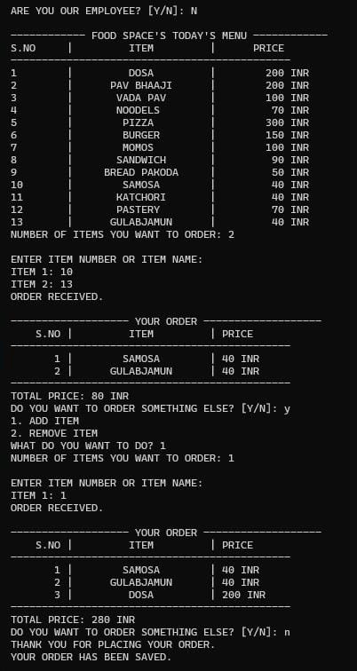
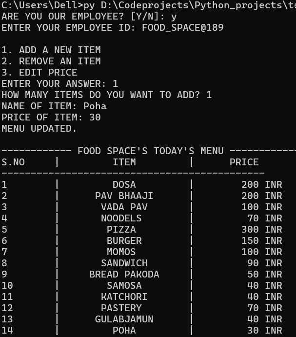

# FOOD SPACE — Console-Based Food Ordering & Menu Management System

***A lightweight, dependency-free Python console application that lets a customer browse a live
menu, place and modify a multi-item order with a running bill, and confirm it for billing —
while a separate, identity-gated path lets an authorised employee add items, remove items, or
update prices.***

## *(1). Overview:*

***Small food counters and canteens often take orders by hand, which does not scale:***
- Prices drift out of sync
- Totals get mis-added during a rush
- There is no record of what actually sold.

***FOOD SPACE removes that friction with a single Python script and two plain text files — no
database server, no external services, no internet connection required.***

## *(2). Features*

- **Live, numbered menu** — *Auto-created on first run, always shown before ordering.*

- **Order by number or by name** — *Pick whichever is faster in the moment.*

- **Modify an order in progress** — *Add more items or remove specific ones before confirming.*

- **Running bill total** — *Every item is priced from the live menu as you go.*

- **Persistent sales log** — *Every confirmed order is appended to `order_history.txt`.*

- **Employee-only menu management** — 
- *Add an item*
- *Remove an item* 
- *Edit a price* 
- *Gated behind an employee-ID check (`FOOD_SPACE@…`).*

- **Robust input handling** — invalid, out-of-range, or non-numeric input re-prompts instead of
  crashing the program.

## *(3). Technologies / Tools Used*

| Tool | Purpose |
|---|---|
| *Python 3 (standard library only)* | *Core application logic — No third-party packages required* |
| *Plain text files* (`menu.txt`, `order_history.txt`) | *Persistent storage for the menu and sales history* |
| *Git & GitHub* | *Version control and submission* |

## *(4). Project Structure*

```
food-space/
├── food_space.py         # main application (see note below)
├── menu.txt              #created                                      
automatically on first run
├── order_history.txt     # created     automatically on first confirmed order
├── README.md
├── statement.md
└── docs/
    └── project_report.pdf
```

> ***Note:*** *The application currently lives in a single file, organised into twelve
> single-purpose functions.*

## **(5). Installation & Running**

**Requirements:** *Python 3.8 or later. No external packages needed.*

```bash
# 1. Clone the repository
git clone https://github.com/<your-username>/<your-repo>.git
cd <your-repo>

# 2. Run the application
python3 food_space.py
```

*On first run, if `menu.txt` doesn't exist yet, so the program creates it automatically with a
default 13-item menu.

## **(6).How to Use**

**As a customer:**
1. *Answer `N` when asked "ARE YOU OUR EMPLOYEE?"*
2. *Browse the numbered menu that's displayed.*
3. *Enter how many items you want, then enter each one by its number or its name.*
4. *Review the order total, and answer `Y` to keep adding items or `N` to confirm and save it.*

**As an employee:**
1. *Answer `Y` when asked "ARE YOU OUR EMPLOYEE?"*
2. *Enter an employee ID starting with `FOOD_SPACE@` (e.g. `FOOD_SPACE@001`).*
3. *Choose to add a new item, remove an item, or edit a price — changes save to `menu.txt`
   immediately.*
4. *You'll then see the updated menu and can place an order like any customer.*

## *(7).Testing*

- End-to-end runs of both the customer and employee flows, with totals cross-checked by hand.
- Boundary/invalid input against every numeric prompt (letters, blanks, negative numbers,
  out-of-range values).
- Out-of-menu item selection (an unused number, a misspelled name).
- Deleting `menu.txt` before a run, to confirm the default menu is recreated automatically.

## *(8). Screenshots*

See `docs/project_report.pdf` for full console transcripts of a
customer ordering flow



-------|-------|-------|-------|-------|-------|-------|-------|



## *(9). Documentation*

- [`statement.md`](./statement.md) — 
  - Problem statement
  - Scope 
  - Target users
  - High-level features
- [`docs/project_report.pdf`](./docs/project_report.pdf) — 
- Full project report consists of: 
  - Requirements
  - Architecture d
  - Design diagrams (use case, workflow, sequence, component, ER)
  - Design decisions
  - Implementation details, testing, challenges, and future enhancements.

## *(10). Future Enhancements*

 - *Split into a proper multi-file package* 
 - *Automated pytest suite* 
 - *Migrate storage to SQLite* ·
 - Real employee credential check 
 - Order timestamps & daily sales summary 
 - Quantities per item 
 - GUI/web front-end. 
 
 ***See the project report for details.***

## Author

```[Lalit Kumar] — [26BCG10012] ```
